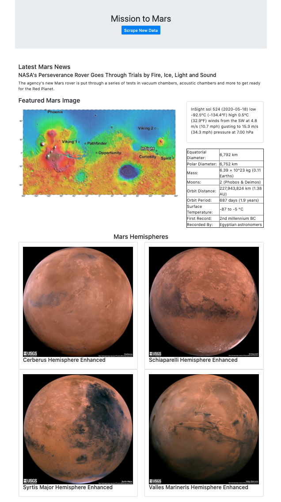

# Web Scraping Homework - Mission to Mars

## Instruction

### MongoDB set up

Replace MongoDB host to your own.

```python
# in app.py
app.config['MONGODB_SETTINGS'] = {
    'host': os.getenv('MONGODB'),
}
```

### Run Flask application

```sh
$ export FLASK_APP=src/app.py
$ flask run
 * Running on http://127.0.0.1:5000/
```

### Screenshot of the application


